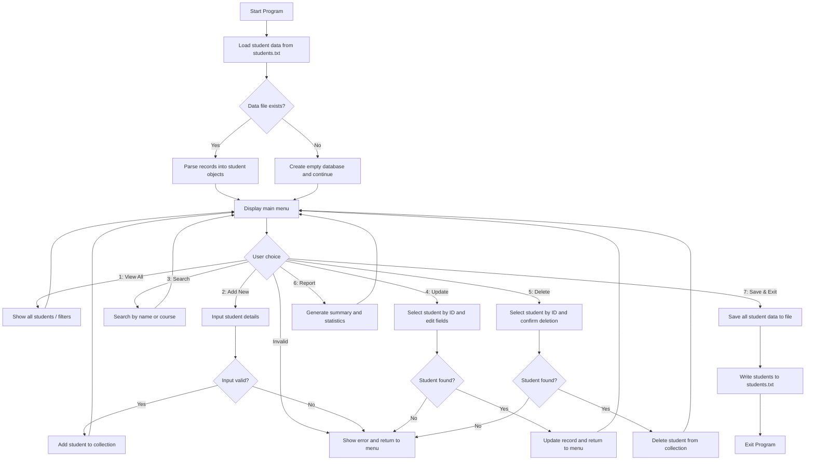

# Flowchart - Student Manager System Core Logic

```mermaid
flowchart TD
    A[Start Program] --> B[Load student data from students.txt]
    B --> C{Data file exists?}
    C -->|Yes| D[Parse records into student objects]
    C -->|No| E[Create empty database and continue]
    D --> F[Display main menu]
    E --> F
    
    F --> G{User choice}
    G -->|1: View All| H[Show all students / filters]
    G -->|2: Add New| I[Input student details]
    G -->|3: Search| J[Search by name or course]
    G -->|4: Update| K[Select student by ID and edit fields]
    G -->|5: Delete| L[Select student by ID and confirm deletion]
    G -->|6: Report| M[Generate summary and statistics]
    G -->|7: Save & Exit| N[Save all student data to file]
    G -->|Invalid| O[Show error and return to menu]
    
    H --> F
    I --> P{Input valid?}
    P -->|Yes| Q[Add student to collection]
    P -->|No| O
    Q --> F
    J --> F
    K --> P2{Student found?}
    P2 -->|Yes| R[Update record and return to menu]
    P2 -->|No| O
    R --> F
    L --> P3{Student found?}
    P3 -->|Yes| S[Delete student from collection]
    P3 -->|No| O
    S --> F
    M --> F
    N --> T[Write students to students.txt]
    T --> U[Exit Program]
```